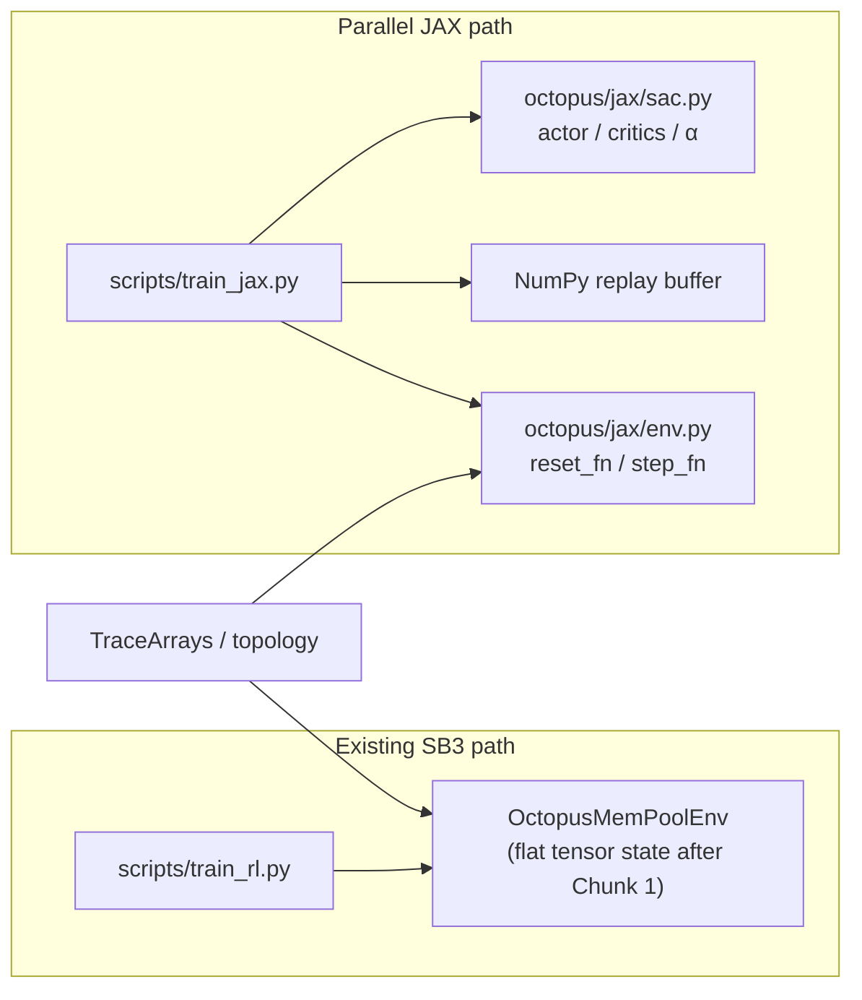

# Parallel JAX training setup — octopus-allocation

## Goal

Run a **parallel JAX SAC trainer** alongside the existing Stable-Baselines3 pipeline, targeting
**comparable sampling dynamics** (reward variant A/B, similar network width, replay + soft
updates) so throughput and learning curves can be compared against:

1. **Current** Gymnasium + Stable-Baselines3
2. **Flat-tensor NumPy env** (SPEEDUP_PLAN Change 1) + Stable-Baselines3

**Non-goal for v1:** Replace all callbacks, async eval workers, W&B integration, or
multi-trace training in one shot.

---

## Prerequisites (hard gate)

**JAX Phase 1 does not begin until SPEEDUP_PLAN Chunks 0–1 are merged.**

| Chunk | What it delivers | Why JAX needs it |
|-------|-----------------|-----------------|
| Chunk 0 | 23 broken tests fixed | Clean regression baseline before adding a second env |
| Chunk 1 | `_mpd_dt (num_mhd, MAX_SLOTS)`, `_mpd_mem (num_mhd, MAX_SLOTS)`, `_mpd_n (num_mhd,)` in SB3 env | JAX OctopusState mirrors these exactly — no design divergence |

Chunk 2 (`precompute_pod_events_arrays`) is not required for Phase 1 but must land before
multi-trace work (deferred to Phase 5).

---

## Principles

| Principle | Detail |
|-----------|--------|
| **Isolation** | New module `octopus/jax/` — SB3 imports stay untouched |
| **Numeric parity hooks** | Single-step and short-rollout checks vs NumPy Gym env |
| **Static shapes** | JIT favors fixed `obs_dim`, `action_dim`, `num_mhd`, `MAX_TICKS`, `MAX_ACTIVE_VMS` |
| **CPU-first correctness** | Use `jax.disable_jit` and tiny runs before relying on GPU |
| **Aligned episode logic** | Port pod sampling, event construction, and reward semantics faithfully |

---

## Architecture (high level)



---

## Global constants (derived from full trace sweep)

| Constant | Value | Source |
|----------|-------|--------|
| `MAX_TICKS` | **2304** | All 10 traces × 50 seeds: every pod_dur is exactly 2304 ticks (8-day window at 5-min resolution) |
| `MAX_ACTIVE_VMS` | **256** | Empirical max 131 VMs simultaneously on one MPD (worst-case, no policy); 256 is 2× headroom, power of 2 |

---

## Phase 0 — Dependencies

1. **Python deps:** add optional stack — `jax`, `jaxlib`, `flax` (or `equinox`), `optax`,
   `chex`. Pin in `requirements-jax.txt` or `pyproject.toml` extras `[jax]`.
2. **Platforms:** document `JAX_PLATFORM_NAME=cpu|cuda`. Default to CPU for Phase 1.
3. **Tiny fixtures:** one small trace/topology combo for deterministic tests that finish in
   seconds.

---

## Phase 1 — JAX environment contract (pure functions)

### 1.1 State as an immutable struct

Define **`OctopusState`** (`@chex.dataclass` or `flax.struct.dataclass`) with the following
fields. All shapes are static — no dynamic allocation inside `step_fn`.

**Mutable simulation state:**

| Field | Shape | dtype | Notes |
|-------|-------|-------|-------|
| `mpd_load` | `(num_mhd,)` | float32 | Current CXL memory per MPD (GB) |
| `dealloc_buf` | `(2304, num_mhd)` | float32 | Scheduled MPD deallocations per tick |
| `host_load` | `(pod_size,)` | float32 | Current CXL load per host |
| `host_dealloc_buf` | `(2304, pod_size)` | float32 | Scheduled host deallocations per tick |
| `_mpd_dt` | `(num_mhd, 256)` | int32 | Dealloc tick per active VM slot per MPD |
| `_mpd_mem` | `(num_mhd, 256)` | float32 | Memory (GB) per active VM slot per MPD |
| `_mpd_n` | `(num_mhd,)` | int32 | Valid VM count per MPD (append pointer) |
| `max_peak` | scalar | float32 | Running episode max MPD load (for pooling_ratio at done) |
| `event_idx` | scalar | int32 | Index into the static events array |
| `last_depart_tick` | scalar | int32 | Last tick through which departures were applied |
| `key` | — | JAX PRNG | Episode RNG key |

**Static config (compiled-in per episode, not in OctopusState):**

| Field | Shape | Notes |
|-------|-------|-------|
| `events` | `(MAX_EVENTS, 4)` | `[tick, node_in_pod_id, vm_mem_gb, dealloc_tick]`; padded with sentinel rows (tick = -1) |
| `host_to_mhds` | padded mask | Accessible MPD indices per host |
| `mhd_to_hosts` | padded membership | Host indices per MPD (needed for P_j) |
| `Q_j` | `(num_mhd,)` | MPD scarcity; topology-derived, static (augmentation deferred to Phase 5) |
| `pod_dram` | scalar | Total pod DRAM (GB); normalisation constant |
| `reward_variant` | int | 0=current, 1=A, 2=B |
| `lookahead_window W` | int | For D_j / S_j computation |
| `reward_lambda λ` | float | Reward B global-term weight |

> **`_mpd_dt/_mpd_mem` are append-only — no explicit purge step.**
> D_j and S_j computation masks entries by `_mpd_dt > tick` and `_mpd_dt <= tick+W`.
> Entries for departed VMs are simply excluded by the mask; no compaction needed.
> This eliminates the list-comprehension purge from `_process_departures_through`.

### 1.2 `reset_fn(key, static_config) → (OctopusState, obs)`

Pod selection and event construction run **on the host** (CPU, Python), then results are
transferred to device via `jax.device_put`. This preserves exact parity with SB3's
`_generate_pod` / `_build_events`, which use Python's stdlib `random.shuffle` — not
reproducible by JAX PRNG for the same seed.

Recommended v1 flow:

```
host:
  _generate_pod(seed)            # _random.seed(seed); _random.shuffle(indices)
  _build_events()                # HOTFIX filter, sort
  pad events → (MAX_EVENTS, 4)  # sentinel rows: tick = -1
  jax.device_put(padded arrays)  # transfer once per episode

device:
  zero all mutable state fields
  process departures up to first event tick
  return _get_obs_fn(state, static), info
```

v1 is **single-trace only**. Multi-trace is deferred to Phase 5.

### 1.3 `step_fn(state, action, static) → (OctopusState, obs, reward, done)`

Mirror `OctopusMemPoolEnv.step()` in pure JAX:

**Allocation:**
- Softmax over accessible MPDs for the arriving host (mask inactive logits)
- `dealloc_buf = dealloc_buf.at[dealloc_tick, mhd_list].add(alloc_gb)`
- `mpd_load = mpd_load.at[mhd_list].add(alloc_gb)`
- Append to `_mpd_dt/_mpd_mem` at column `_mpd_n[j]`; increment `_mpd_n[j]`
- `host_dealloc_buf = host_dealloc_buf.at[dealloc_tick, node_id].add(vm_mem)`
- `host_load = host_load.at[node_id].add(vm_mem)`

**Departure processing — batch-subtract via tick mask (no inner scan):**

```python
t_idx = jnp.arange(MAX_TICKS)                                    # (2304,) static
mask  = (t_idx > state.last_depart_tick) & (t_idx <= next_tick)  # (2304,) dynamic

delta_mpd  = jnp.einsum('t,tj->j', mask, state.dealloc_buf)      # (num_mhd,)
delta_host = jnp.einsum('t,tp->p', mask, state.host_dealloc_buf) # (pod_size,)

mpd_load  = jnp.maximum(state.mpd_load  - delta_mpd,  0.0)
host_load = jnp.maximum(state.host_load - delta_host, 0.0)
```

All shapes are static. No inner scan, no `MAX_GAP` constant.

**D_j / S_j computation** (for reward A/B and obs):

```python
# All ops vectorized over the (num_mhd, 256) arrays
valid   = jnp.arange(256)[None, :] < state._mpd_n[:, None]   # (num_mhd, 256)
near    = (state._mpd_dt <= tick + W) & valid
far     = (state._mpd_dt > tick + W) & valid
weight  = 1.0 - (state._mpd_dt - tick) / W
D_j     = jnp.where(near, state._mpd_mem * weight, 0.0).sum(axis=1)  # (num_mhd,)
S_j     = jnp.where(far,  state._mpd_mem,           0.0).sum(axis=1)  # (num_mhd,)
```

**Reward dispatch:**
For a fixed `reward_variant` per run, compile a **separate `jax.jit`-ted kernel** for each
variant. Do not use `jnp.where` to speculatively compute all three branches.

### 1.4 Observations

Match `_get_obs` layout and dtypes exactly:

| Variant | Obs dim | Contents |
|---------|---------|---------|
| `current` | `2·max_degree + 4` | MPD loads (norm), mask, vm_norm, peak_norm, hour_sin, hour_cos |
| `A` / `B` | `6·max_degree + 2` | Per accessible MPD: c_j, D_j, S_j, mask=1, P_j, Q_j; global: peak/D_pod, vm_mem/D_pod |

`max_degree` is a static config param (8 for the default 16×6 topology → 50-dim A/B obs).

Target byte-level parity vs reference env on fixture seeds (within documented float64 tolerance).

### 1.5 Tests

Run all parity tests under **`jax.config.update("jax_enable_x64", True)`** (float64 mode).
Production training uses float32 (default JAX). These are separate configurations.

| Test | Assertion |
|------|-----------|
| `test_jax_step_matches_gym_current` | 200 steps: obs `allclose` `atol=1e-5`; reward `atol=1e-6` |
| `test_jax_step_matches_gym_A` | Same, reward variant A |
| `test_jax_step_matches_gym_B` | Same, reward variant B |
| `test_reset_deterministic` | Same seed → same first obs (uses host PRNG path, not JAX PRNG) |
| `test_jit_step_shapes` | `jax.jit(step_fn)` over a synthetic full-length episode; no recompilation |

**Gate:** Phase 2 starts only after all five parity tests pass in float64 mode.

---

## Phase 2 — Vectorized rollout (no SAC yet)

1. Implement **`rollout_chunk`** with `jax.lax.scan` over a fixed horizon `H` (aligned with
   `train_freq` or a sub-multiple). The batch-subtract departure body (§1.3) is the scan
   body — all shapes static, no inner scan.
2. **`jax.vmap` over `n_envs`** for parallel collectors; split PRNG keys per env.
3. **Benchmark** env-only steps/sec vs `SubprocVecEnv` at matched `n_envs` and horizon.

**Gate:** No Python in the hot per-step path. Verify with `jax.make_jaxpr(rollout_chunk)` —
no `python_callable` nodes in the trace.

---

## Phase 3 — JAX SAC skeleton

### 3.1 Networks

- MLP actor, twin critics, learned log α — mirror SB3 SAC defaults (width, LR 3e-4, τ, γ).
- Document any intentional divergences (distribution parameterisation, etc.).

### 3.2 Replay buffer

**v1:** Host-side circular buffer in NumPy. Fixed size `buffer_size`; ring write pointer;
oldest entries overwritten when full. Batches transferred to device per update step.

**Later:** Full device-resident buffer if env throughput demands it.

### 3.3 Update step

JIT-compiled blocks:

- Critic loss (Bellman) + actor loss + α loss (standard SAC)
- Soft target update for critic targets (τ blend)

### 3.4 Training entrypoint — `scripts/train_jax.py`

Mirror a subset of `scripts/train_rl.py` CLI:

```
--run-id --seed --n-envs --total-timesteps
--reward-variant --lookahead-window --reward-lambda
--trace  (single trace name — v1 is single-trace only)
```

- **Checkpoints:** Orbax or pickle of `params`; `config.json` includes `trainer: "jax"`.
- **Logging:** TensorBoard and/or W&B with scalar names aligned to SB3 where possible.

**Gate:** 50k-step smoke: stable losses, nonzero grad norms.

---

## Phase 4 — Fair comparison protocol

### Fixed config snapshot

Capture in each run's `config.json`:

| Field | Must match across SB3 vs JAX |
|-------|-------------------------------|
| `reward_variant`, `lookahead_window`, `reward_lambda` | yes |
| `batch_size`, `buffer_size`, `gamma`, `tau`, learning rates | yes (or documented delta) |
| Effective env steps per policy update (`train_freq × n_envs`) | yes |
| `learning_starts` | yes |
| Seeds | identical |
| `trace` | identical (single trace, v1) |

### Metrics

- Wall time to N steps
- Env samples/sec vs end-to-end wall steps/sec
- Eval / pooling metrics if/when a JAX eval path exists

### Acceptance

- Phase 1 parity tests green (float64 mode)
- Optional 500k-step calibration vs flat-tensor SB3 (±1σ on `eval/mean_reward` at 100k / 200k / 500k steps)

### Measured SB3 baseline (2026-05-05) — target to beat

All numbers are **env-only throughput** (random actions, no policy inference, no SAC updates).
Full training fps (including GPU policy + SAC updates) is lower; measured at ~53 fps for run7.
See `docs/plans/v4/throughput_log.md` for full data.

| Config | Steady-state fps | Overall fps |
|--------|-----------------|-------------|
| Pre-SPEEDUP_PLAN (list-of-lists, no cache, no JIT) | 1,009 | 1,053 |
| Post-SPEEDUP_PLAN (flat arrays + Numba + precompute cache) | **2,757** | **2,799** |

**Speedup from SPEEDUP_PLAN Chunks 1–3: 2.73×** (env-only).

JAX target: beat 2,757 fps env-only at matched `n_envs=32` and topology.

---

## Phase 5 — Deferred backlog

| Item | Notes |
|------|--------|
| Multi-trace training | Two options: (A) one compiled `reset_fn` per trace (10 compilations); (B) `events` as a dynamic traced arg to `reset_fn` (avoids recompilation, some XLA optimisation loss). Choose after Phase 3 profiling. |
| Augmentation on device | Host apply + pad is sufficient for v1; augmentation also modifies `Q_j` (currently static config) |
| Async eval worker with JAX weights | Requires JAX-side eval or weight export to PyTorch |
| Rewriting `precompute_pod_events` for JAX | Host precompute into static buffers is fine initially |

---

## Deliverables checklist

| Deliverable | Location |
|-------------|----------|
| Pure env + parity tests | `octopus/jax/env.py`, `tests/test_jax_env_parity.py` |
| SAC + train CLI | `octopus/jax/sac.py`, `scripts/train_jax.py` |
| Optional deps | `requirements-jax.txt` or `[project.optional-dependencies]` |
| Run metadata | `output/checkpoints/<run_id>/config.json` includes `trainer: "jax"` |

---

## Risks and mitigations

| Risk | Mitigation |
|------|------------|
| Float32 drift vs SB3 float64 | Parity gate runs in float64 mode (`jax_enable_x64`); production training uses float32 separately |
| `dealloc_buf.at[].add()` copy cost | `(2304, 6) × float32 ≈ 55 KB` per allocation — acceptable on GPU |
| `_mpd_n[j]` overflow beyond 256 | Assert `_mpd_n[j] < MAX_ACTIVE_VMS` in debug / test mode; empirical max is 131 (worst-case, no policy) |
| Scope creep | Multi-trace, augmentation, async eval all explicitly deferred to Phase 5 |

---

## Relationship to SPEEDUP_PLAN

This document is **additive and sequenced**. SPEEDUP_PLAN Chunks 0–1 must land first; JAX
mirrors the flat tensor SB3 state rather than diverging from it. The NumPy flat-tensor and
cache work remains the primary low-risk throughput path inside SB3; JAX proves whether
compiled batched rollout + updates outperform that stack enough to justify complexity.

---

## Open decisions (none blocking Phase 1)

| ID | Decision | Status |
|----|----------|--------|
| 1 | First platform | CPU JAX for Phase 1 correctness; CUDA from Phase 2 benchmark |
| 2 | RL scope | SAC only for v1 |
| 3 | Eval | Native JAX rollout vs exporting weights — deferred to Phase 4/5 |
| 4 | Multi-trace strategy | Deferred to Phase 5; options documented above |

---

## Document history

| Date | Change |
|------|--------|
| 2026-05-01 | Initial draft |
| 2026-05-01 | v2: impact-analysis pass — MAX_TICKS=2304, MAX_ACTIVE_VMS=256, batch-subtract departure processing, host_load/host_dealloc_buf required, Q_j static, max_peak in OctopusState, float64 parity gate, single-trace v1, gated on SPEEDUP_PLAN Chunks 0–1 |
| 2026-05-05 | v3: SPEEDUP_PLAN complete (Chunks 0–3, 145 tests); measured SB3 baselines added to Phase 4; throughput log at `docs/plans/v4/throughput_log.md` |
